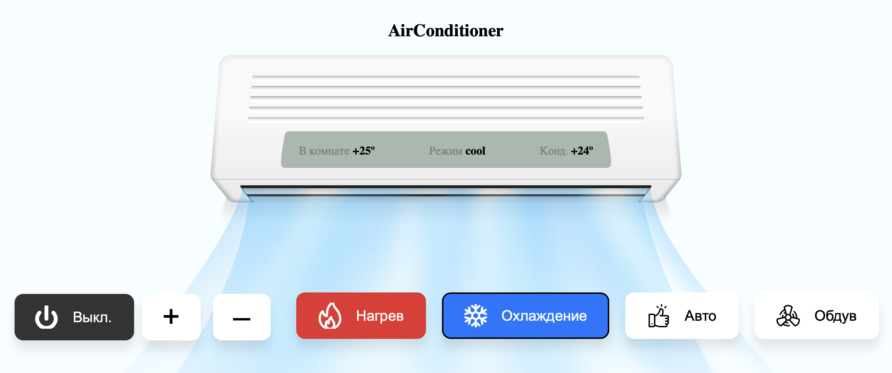

# alice example



### Usage

#### 1. register oauth client needed to work with alice api

- Go to https://oauth.yandex.ru/client/new and create new oauth client
- Check API Яндекс.Паспорта (login) ↘︎ login:email
- Save ID and secret:

```text
ID: 46b4112266ea647729cc03b8e8ea60ff
Пароль: 0650438ca8e0f1c4410a44e5b903b0a6
Callback URL: https://oauth.yandex.ru/verification_code
```

#### 2. create smart home dialog

- Go to https://dialogs.yandex.ru/developer, click create dialog and check smart home dialog
- Before you can test your skill you must fill all required fields
- ...even dialog icon lol :)
- Endpoint URL: `https://<your-subdomain>.serverless.social/alice`. Endpoint must be https://. This will be localtunnel url that we'll create later.
- fill authorization credentials:

```text
Client Identifier: <ID>
Client Password: <Пароль>
API authorization endpoint: https://oauth.yandex.ru/authorize
Token endpoint: https://oauth.yandex.ru/token
```

#### 3. start localtunnel to your pc

```bash
npm run tunnel -- --subdomain cool-monkey-87
```

Use some random unique url. So Endpoint URL in step 2 must be `https://cool-monkey-87.serverless.social/alice`

#### 4. launch app

```bash
npm i
DEBUG="app:*" npm run dev
```

Site must be available on public host `https://cool-monkey-87.serverless.social/alice` but to work locally we can use `http://localhost:3000`

Open `http://localhost:3000` and we're ready to go!

When you open site, browser creates websocket connection with node server. State is stored in react app. React listens to websocket commands and performs update. Alice will be sending requests to our server via tunnel and server will transform these requests to websocket commands. IMPORTANT! Virtual device is created on websocket connection. So without open website alice will recieve empty device response.

#### 5. test your app

Open testing tab in your skill webpage and authorize your app

Click sync devices and you should see your device in list
